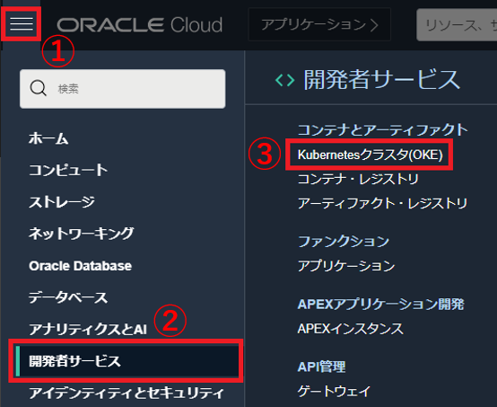
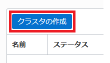
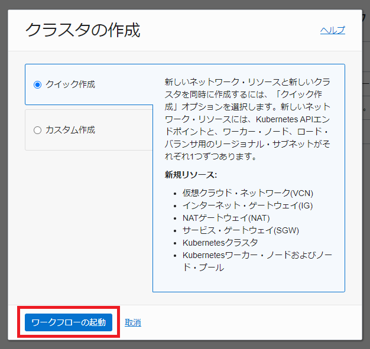
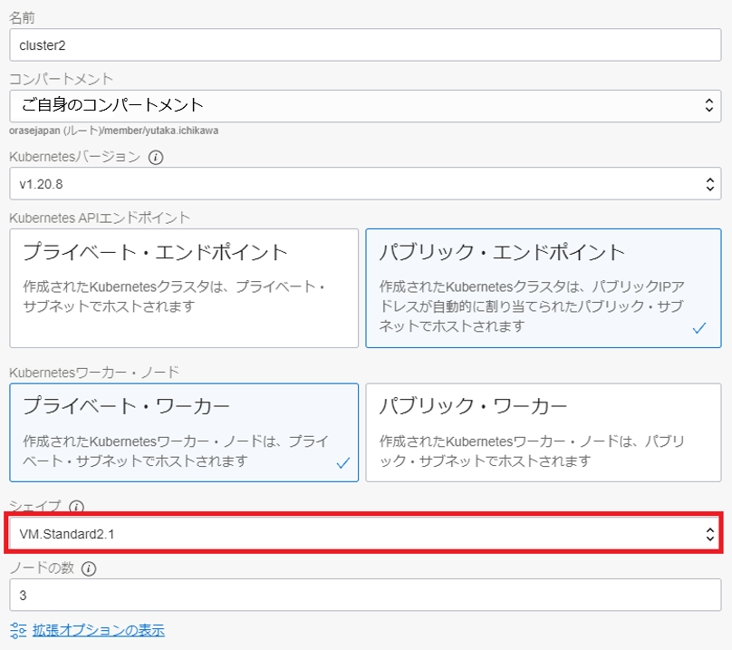
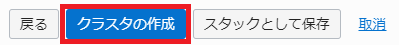
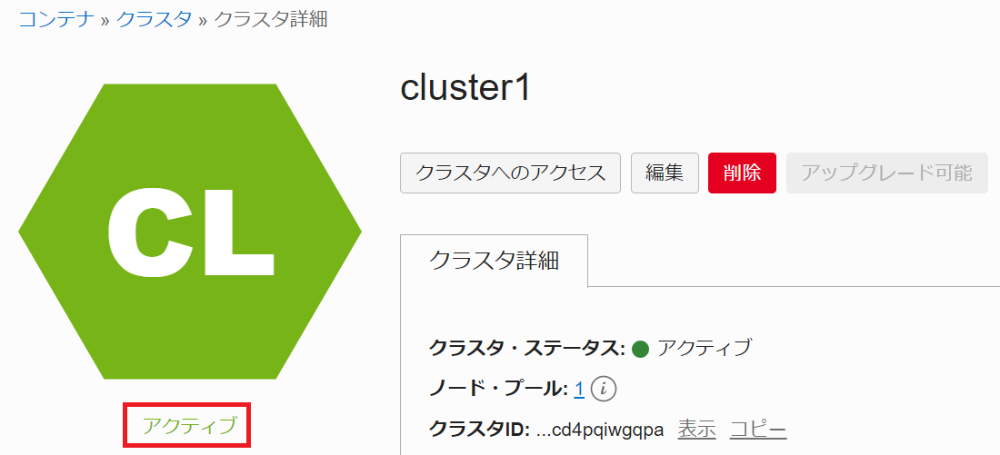
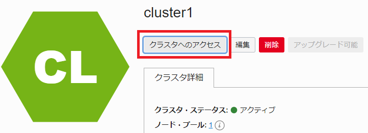
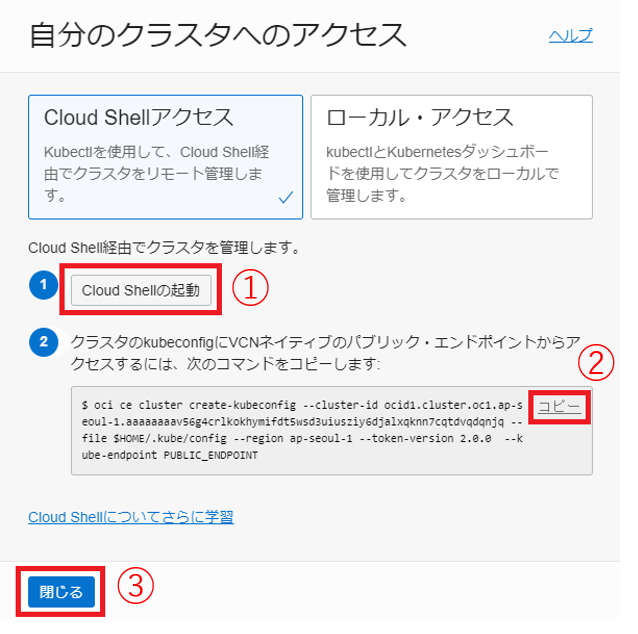
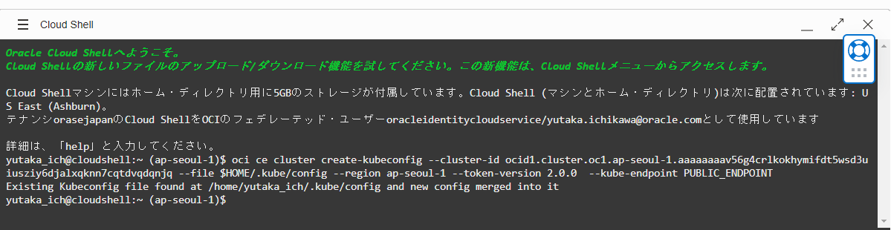
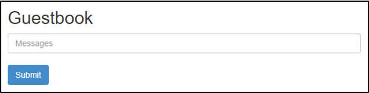

1.OKEクラスタ構築
---------------------------------

### 1-1 OCIコンソールからOKEクラスタの構築

左上のハンバーガーメニューを展開して、「開発者サービス」から「Kubernetesクラスタ(OKE)」を選択します。



「クラスタの作成」ボタンをクリックします。



「クイック作成」が選択されていることを確認して、「ワークフローの起動」ボタンをクリックします。



以下を設定します。

「シェイプ」：「VM.Standard2.1」



画面左下の「次」ボタンをクリックします。


画面左下の「クラスタ作成」ボタンをクリックします。



画面左下の「閉じる」ボタンをクリックします。


黄色の「作成中」から緑の「アクティブ」になることを確認します。「アクティブ」であればクラスタ作成は完了です。



### 1-2 Cloud Shellを利用してクラスタを操作

Cloud Shellを利用して、作成したKubernetesクラスタに接続します。

「クラスタへのアクセス」ボタンをクリックします。



「Cloud Shellの起動」ボタン、「コピー」リンクテキスト、「閉じる」ボタンの順にクリックします。



Cloud Shell起動後、「コピー」した内容をペーストして、Enterキーを押します。



以下コマンドを実行して、3ノードの「STATUS」が「Ready」になっていることを確認します。

```sh
kubectl get nodes
```
***コマンド結果***
```sh
NAME          STATUS   ROLES   AGE    VERSION
10.0.10.106   Ready    node    18s    v1.20.8
10.0.10.214   Ready    node    100s   v1.20.8
10.0.10.65    Ready    node    117s   v1.20.8
```

2.サンプルアプリケーションのデプロイ
---------------------------------

'kubectl' コマンドを利用して、作成したKubernetesクラスタにサンプルアプリケーションをデプロイします。

```sh
kubectl apply -f https://raw.githubusercontent.com/oracle-japan/oke-handson-guestbook/master/sample-application/guestbook-all-in-one.yaml
```

3個の'frontend' 2個の'redis-slave' 1個の'redis-master' のPod STATUSが 'Running' になっていることを確認します。

```sh
kubectl get pods
```
```sh
NAME                           READY   STATUS    RESTARTS   AGE
frontend-6c6d6dfd4d-7nnpf      1/1     Running   0          29s
frontend-6c6d6dfd4d-slwrs      1/1     Running   0          29s
frontend-6c6d6dfd4d-vjwls      1/1     Running   0          29s
redis-master-f46ff57fd-q6gpp   1/1     Running   0          32s
redis-slave-7979cfdfb8-bxkwb   1/1     Running   0          30s
redis-slave-7979cfdfb8-n8pcq   1/1     Running   0          30s
```

Webブラウザでアクセスするために、'EXTERNAL-IP'を確認します。

```sh
kubectl get services
```
```sh
NAME           TYPE           CLUSTER-IP     EXTERNAL-IP      PORT(S)        AGE
frontend       LoadBalancer   10.96.225.11   132.226.xxx.xxx  80:32630/TCP   46s
kubernetes     ClusterIP      10.96.0.1      <none>           443/TCP        37m
redis-master   ClusterIP      10.96.22.84    <none>           6379/TCP       49s
redis-slave    ClusterIP      10.96.63.255   <none>           6379/TCP       47s
```

Webブラウザを起動して、'http://132.226.xxx.xxx/' にアクセスします。

以下の画面が表示されれば完了です。



